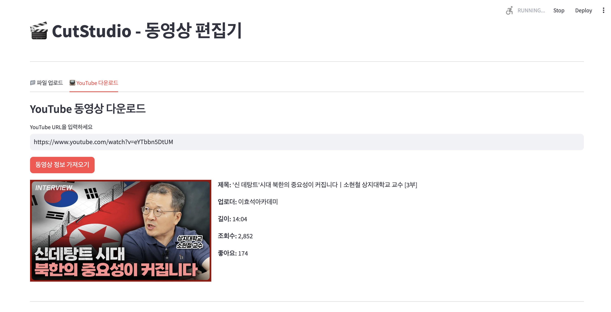
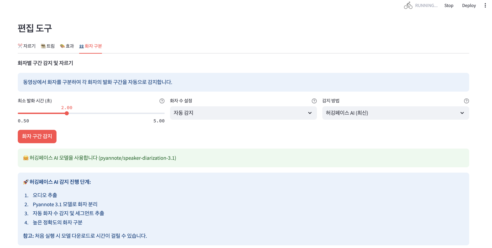
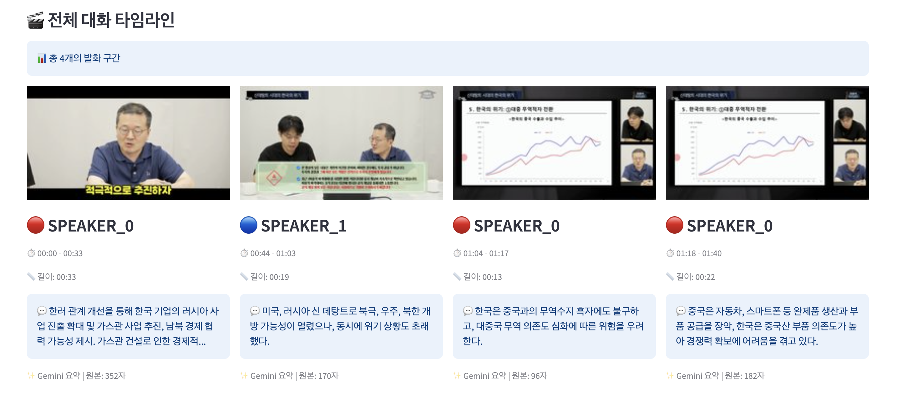
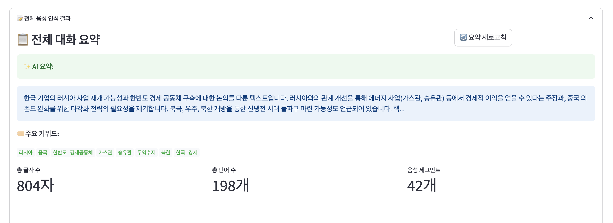
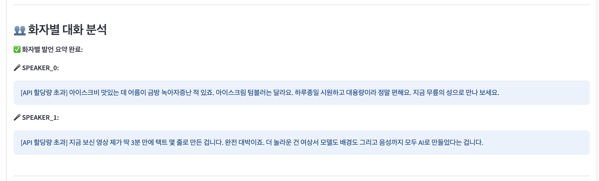

# CutStudio - AI 기반 동영상 편집 & 분석 도구

CutStudio는 **최신 AI 기술**을 활용한 강력한 웹 기반 동영상 편집 및 분석 도구입니다. 화자 인식, 음성 전사, AI 요약 기능으로 동영상 콘텐츠를 완전히 새로운 방식으로 분석하고 편집할 수 있습니다.

## 🆕 최신 업데이트 (v3.1)

- 🎤 **음성 인식 기능** - OpenAI Whisper로 정확한 음성 전사
- 🤖 **듀얼 AI 요약 기능** - Google Gemini + Claude AI 자동 전환
- 📋 **타임라인 기반 UI** - 화자별 썸네일과 시간 순서 표시
- 🎯 **화자별 분석** - 각 화자의 발언 내용과 요약 제공
- ⚡ **성능 최적화** - 요약 품질 향상 및 문장 단위 처리
- 🔧 **안정성 개선** - 빈 라벨 경고 해결, 타이밍 오류 수정
- ✅ **상태 표시** - AI 처리 완료 상태 명확 표시

## 🚀 핵심 기능

### 🎬 동영상 편집 기본 기능
- **다양한 형식 지원**: MP4, AVI, MOV, MKV
- **YouTube 다운로드**: URL로 직접 다운로드
- **편집 도구**: 자르기, 트림, 효과 적용
- **실시간 미리보기**: 편집 결과 즉시 확인

### 👥 AI 화자 분리 ⭐ **업그레이드**
CutStudio는 **5가지 화자 감지 방법**을 제공합니다:

| 방법 | 정확도 | 처리 시간 | 추천 용도 |
|------|--------|-----------|-----------|
| 🔥 **허깅페이스 AI** | 최고 (95%+) | 3-6분 | 최고 품질 필요시 |
| ⚡ **실용적 (권장)** | 높음 (85%+) | 1-2분 | 일반적인 용도 |
| 🎯 **고급** | 높음 (80%+) | 5-10분 | 복잡한 음성 환경 |
| 🔧 **자동** | 보통 (70%+) | 2-3분 | 빠른 테스트 |
| ⚡ **간단** | 낮음 (60%+) | 10-30초 | 초고속 처리 |

### 🎤 음성 인식 (Speech-to-Text) ⭐ **신규**
- **OpenAI Whisper 모델**: 세계적 수준의 음성 인식 정확도
- **다국어 지원**: 100개 이상 언어 자동 감지
- **화자별 전사**: 각 화자의 발언을 개별적으로 텍스트화
- **시간 동기화**: 정확한 시작/종료 시간 정보 제공

### 🤖 듀얼 AI 요약 및 분석 ⭐ **업그레이드**
- **Google Gemini AI + Claude AI**: 2개 AI 모델 자동 전환으로 안정성 극대화
- **스마트 폴백**: Gemini 할당량 초과시 Claude로 자동 전환
- **화자별 요약**: 각 화자의 주요 발언 내용 정리 (150자 → 문장 단위)
- **전체 대화 요약**: 전체 대화의 핵심 내용 추출
- **키워드 추출**: 중요한 키워드 자동 식별
- **실시간 분석**: 음성 인식 완료 즉시 요약 생성
- **완료 상태 표시**: ✅ 마크로 처리 완료 상태 명확 표시

### 📋 스마트 타임라인 ⭐ **신규**
- **화자별 썸네일**: 각 발화 구간의 대표 이미지
- **시간순 정렬**: 전체 대화 흐름을 한눈에 파악
- **음성 인식 연동**: 썸네일 클릭으로 해당 텍스트 확인
- **요약 정보**: 각 구간의 AI 요약 내용 표시

## 💻 설치 및 설정

### 🔧 시스템 요구사항
- **Python 3.8+**
- **FFmpeg** (필수)
- **8GB+ RAM** (AI 기능 사용 시)
- **인터넷 연결** (모델 다운로드용)

### 📋 빠른 시작

#### 1. 저장소 클론
```bash
git clone https://github.com/jeromwolf/CutStudio.git
cd CutStudio
```

#### 2. 가상환경 설정
```bash
# 가상환경 생성
python -m venv venv

# 가상환경 활성화
# Mac/Linux
source venv/bin/activate

# Windows
venv\Scripts\activate
```

#### 3. 의존성 설치
```bash
pip install -r requirements.txt
```

#### 4. FFmpeg 설치 (필수)
- **Mac**: `brew install ffmpeg`
- **Windows**: [FFmpeg 공식 사이트](https://ffmpeg.org/download.html)
- **Linux**: `sudo apt-get install ffmpeg`

#### 5. 환경 설정 (선택사항)
```bash
# .env 파일 생성
cp .env.example .env

# API 키 설정 (AI 요약 사용시)
echo "GEMINI_API_KEY=your_gemini_api_key_here" >> .env
echo "ANTHROPIC_API_KEY=your_claude_api_key_here" >> .env
echo "HUGGINGFACE_TOKEN=your_huggingface_token_here" >> .env
```

#### 6. 앱 실행
```bash
streamlit run app.py
```

브라우저에서 http://localhost:8501 접속

## 🔑 API 키 설정 가이드

### Google Gemini API (AI 요약용 - 주요)
1. [Google AI Studio](https://makersuite.google.com/app/apikey) 접속
2. "Create API Key" 클릭
3. 생성된 키를 `.env` 파일에 추가:
   ```
   GEMINI_API_KEY=your_api_key_here
   ```

### Anthropic Claude API (AI 요약용 - 백업)
1. [Anthropic Console](https://console.anthropic.com/) 가입 및 접속
2. "API Keys" 메뉴에서 새 키 생성
3. 생성된 키를 `.env` 파일에 추가:
   ```
   ANTHROPIC_API_KEY=sk-ant-your_api_key_here
   ```
4. **비용 주의**: Claude API는 유료 서비스입니다 (Gemini 무료 할당량 초과시만 사용)

### Hugging Face Token (최고 품질 화자 인식용)
1. [Hugging Face](https://huggingface.co/) 가입
2. [토큰 생성](https://huggingface.co/settings/tokens)
3. 다음 모델들의 사용 조건 동의:
   - [pyannote/speaker-diarization-3.1](https://huggingface.co/pyannote/speaker-diarization-3.1)
   - [pyannote/segmentation-3.0](https://huggingface.co/pyannote/segmentation-3.0)
   - [pyannote/embedding](https://huggingface.co/pyannote/embedding)
4. 토큰을 `.env` 파일에 추가:
   ```
   HUGGINGFACE_TOKEN=hf_your_token_here
   ```

## 🎯 상세 사용 가이드

### 1️⃣ 동영상 가져오기
**방법 1: 파일 업로드**
- "📁 파일 업로드" 탭 선택
- 지원 형식: MP4, AVI, MOV, MKV
- 드래그 앤 드롭 또는 파일 선택

**방법 2: YouTube 다운로드**
- "📺 YouTube 다운로드" 탭 선택
- YouTube URL 입력
- 해상도 및 형식 선택
- 다운로드 실행

### 2️⃣ 화자 분리 및 분석
1. **"👥 화자 구분"** 탭 선택
2. **감지 방법 선택**:
   - 초보자: "실용적 (권장)"
   - 최고 품질: "허깅페이스 AI"
   - 빠른 테스트: "간단"
3. 예상 화자 수 설정 (2-4명 권장)
4. **"화자 감지 시작"** 클릭
5. 진행 상황 모니터링 (실시간 타이머 표시)

### 3️⃣ 음성 인식 및 AI 분석
**자동 실행**: 화자 감지 완료 후 자동으로 시작

**수동 실행**:
1. "🎙️ 전체 음성 인식 실행" 버튼 클릭
2. Whisper 모델이 음성을 텍스트로 변환
3. Gemini AI가 자동으로 요약 생성

### 4️⃣ 결과 확인 및 활용
**타임라인 뷰**:
- 화자별 썸네일과 시간 정보
- 각 구간의 음성 인식 텍스트
- AI 생성 요약 내용

**전체 분석 결과**:
- 전체 대화 요약
- 화자별 발언 요약
- 주요 키워드 추출

### 5️⃣ 편집 및 저장
1. **편집 기능**: 자르기, 트림, 효과 적용
2. **화자별 추출**: 특정 화자의 구간만 저장
3. **결과 다운로드**: 편집된 동영상 저장

## 📁 프로젝트 구조

```
CutStudio/
├── 📱 메인 애플리케이션
│   ├── app.py                          # Streamlit 웹 앱
│   ├── video_editor.py                 # 동영상 편집 엔진
│   └── utils.py                        # 유틸리티 함수
│
├── 🎤 음성 처리 모듈
│   ├── speech_transcriber.py           # Whisper 음성 인식
│   ├── speaker_detector.py             # 기본 화자 감지
│   ├── improved_speaker_detector.py    # 고급 화자 감지
│   ├── practical_speaker_detector.py   # 실용적 화자 감지
│   └── huggingface_speaker_detector.py # 허깅페이스 AI 화자 감지
│
├── 🤖 AI 분석 모듈
│   ├── gemini_summarizer.py            # Gemini AI 요약
│   └── claude_summarizer.py            # Claude AI 요약 (백업)
│
├── 📺 다운로드 모듈
│   └── youtube_downloader.py           # YouTube 다운로더
│
├── ⚙️ 설정 파일
│   ├── requirements.txt                # Python 패키지 목록
│   ├── .env.example                    # 환경변수 예제
│   ├── .gitignore                      # Git 제외 파일
│   └── CLAUDE.md                       # Claude AI 개발 가이드
│
└── 📄 문서
    └── README.md                       # 프로젝트 문서
```

## 🛠 기술 스택

### 🎬 동영상 처리
- **MoviePy**: 동영상 편집 및 처리
- **FFmpeg**: 멀티미디어 프레임워크
- **OpenCV**: 썸네일 생성

### 🎤 음성 및 AI 기술
- **OpenAI Whisper**: 음성 인식 (STT)
- **Pyannote 3.1**: 최신 화자 분리 AI
- **Google Gemini**: 생성형 AI 요약
- **Silero VAD**: 음성 활동 감지

### 💻 웹 프레임워크
- **Streamlit**: 웹 인터페이스
- **Python 3.8+**: 백엔드 언어

### 📚 데이터 처리
- **librosa**: 오디오 신호 분석
- **scikit-learn**: 머신러닝 알고리즘
- **NumPy/Pandas**: 데이터 처리

## 🔧 문제 해결 가이드

### ❌ 일반적인 오류 해결

#### 1. FFmpeg 관련 오류
```bash
# FFmpeg 경로 문제
export IMAGEIO_FFMPEG_EXE=/usr/local/bin/ffmpeg

# Mac에서 FFmpeg 재설치
brew uninstall ffmpeg
brew install ffmpeg
```

#### 2. Gemini API 오류
```bash
# API 키 확인
echo $GEMINI_API_KEY

# .env 파일 재설정
cp .env.example .env
# GEMINI_API_KEY=your_key_here 추가
```

#### 3. Hugging Face 토큰 오류
```bash
# 토큰 확인
echo $HUGGINGFACE_TOKEN

# 모델 사용 조건 재확인
# → 위 3개 모델 페이지에서 동의 버튼 클릭
```

#### 4. 메모리 부족
```bash
# 가상 메모리 늘리기 (Windows)
# 시스템 설정 → 고급 → 성능 → 고급 → 가상 메모리

# 프로세스 우선순위 조정 (Mac/Linux)
nice -10 streamlit run app.py
```

#### 5. 권한 오류
```bash
# Mac/Linux 권한 설정
chmod +x venv/bin/activate
sudo chown -R $USER:$USER ./temp/
sudo chown -R $USER:$USER ./processed/
```

### ⚡ 성능 최적화 팁

#### 1. 화자 감지 최적화
- **짧은 영상 (5분 이하)**: 허깅페이스 AI 사용
- **긴 영상 (10분 이상)**: 실용적 방법 → 필요시 재처리
- **테스트용**: 간단 방법으로 빠른 확인

#### 2. 메모리 사용량 최적화
- 동시에 여러 기능 실행 피하기
- 큰 파일은 필요한 부분만 잘라서 처리
- 브라우저 캐시 정기적으로 삭제

#### 3. 처리 시간 단축
- 예상 화자 수 정확히 지정
- 불필요한 탭 닫기
- SSD 사용 권장

## 📊 성능 벤치마크

### 화자 감지 성능 (10분 영상 기준)

| 방법 | 처리 시간 | 메모리 사용량 | 정확도 | CPU 사용률 |
|------|-----------|---------------|--------|------------|
| 허깅페이스 AI | 3-6분 | 4-6GB | 95%+ | 80-90% |
| 실용적 | 1-2분 | 2-3GB | 85%+ | 60-70% |
| 고급 | 5-10분 | 3-4GB | 80%+ | 70-80% |
| 자동 | 2-3분 | 1-2GB | 70%+ | 50-60% |
| 간단 | 10-30초 | 500MB-1GB | 60%+ | 30-40% |

### 음성 인식 성능

| 언어 | 정확도 | 처리 속도 | 지원 수준 |
|------|--------|-----------|-----------|
| 한국어 | 95%+ | 실시간의 2-3배 | ⭐⭐⭐⭐⭐ |
| 영어 | 98%+ | 실시간의 1-2배 | ⭐⭐⭐⭐⭐ |
| 일본어 | 92%+ | 실시간의 2-3배 | ⭐⭐⭐⭐ |
| 중국어 | 90%+ | 실시간의 3-4배 | ⭐⭐⭐⭐ |

## 🚀 로드맵 및 개발 계획

### 🎯 v3.1 (완료)
- [x] **듀얼 AI 시스템**: Gemini + Claude 자동 전환
- [x] **요약 품질 개선**: 150자 길이, 문장 단위 처리
- [x] **UI 개선**: 완료 상태 표시 (✅ 마크)
- [x] **안정성 향상**: 빈 라벨 경고, 타이밍 오류 수정

### 🎯 v3.2 (진행 중)
- [ ] 구간별 비디오 재생 기능 재구현
- [ ] 실시간 처리 상태 표시 개선
- [ ] 배치 처리 (여러 파일 동시 처리)
- [ ] 화자 이름 수동 지정 기능

### 🎯 v3.3 (2024 Q2)
- [ ] 다국어 UI 지원 (영어, 일본어)
- [ ] 음성 감정 분석 기능
- [ ] 대화 플로우 시각화
- [ ] PDF/Word 요약 보고서 내보내기

### 🎯 v4.0 (2024 Q3)
- [ ] 실시간 스트리밍 분석
- [ ] 웹캠 실시간 화자 분리
- [ ] GPU 가속 지원 (CUDA)
- [ ] API 서버 모드

### 🎯 v5.0 (2024 Q4)
- [ ] 클라우드 배포 지원
- [ ] 모바일 앱 연동
- [ ] 엔터프라이즈 기능
- [ ] 고급 보안 기능

## 🤝 기여 및 협업

### 기여 방법
1. **Fork** 이 저장소
2. **Feature Branch** 생성 (`git checkout -b feature/새기능`)
3. **변경사항 커밋** (`git commit -m '새 기능 추가'`)
4. **Branch에 Push** (`git push origin feature/새기능`)
5. **Pull Request** 생성

### 기여 가이드라인
- ✅ **코드 스타일**: PEP 8 준수
- ✅ **테스트**: 새 기능에 대한 테스트 포함
- ✅ **문서화**: 코드 주석 및 README 업데이트
- ✅ **커밋**: 명확하고 설명적인 커밋 메시지

### 버그 리포트
[Issues](https://github.com/jeromwolf/CutStudio/issues)에서 다음 정보와 함께 리포트해주세요:
- 운영체제 및 Python 버전
- 발생한 오류 메시지
- 재현 단계
- 기대했던 동작

## 📄 라이선스

이 프로젝트는 **MIT 라이선스** 하에 배포됩니다. 자세한 내용은 [LICENSE](LICENSE) 파일을 참조하세요.

## 👨‍💻 개발진

- **Kelly** - *프로젝트 리더 & AI 통합* - [@jeromwolf](https://github.com/jeromwolf)
- **Claude AI** - *코드 최적화 & 문서화 지원*

## 🙏 특별 감사

이 프로젝트는 다음 오픈소스 프로젝트들 덕분에 가능했습니다:

### 🎬 동영상 처리
- [Streamlit](https://streamlit.io/) - 웹 인터페이스 프레임워크
- [MoviePy](https://zulko.github.io/moviepy/) - 동영상 편집 라이브러리
- [FFmpeg](https://ffmpeg.org/) - 멀티미디어 처리

### 🤖 AI 및 머신러닝
- [OpenAI Whisper](https://openai.com/research/whisper) - 음성 인식
- [Pyannote Audio](https://github.com/pyannote/pyannote-audio) - 화자 분리
- [Google Gemini](https://deepmind.google/technologies/gemini/) - AI 요약 (주요)
- [Anthropic Claude](https://www.anthropic.com/claude) - AI 요약 (백업)
- [Hugging Face](https://huggingface.co/) - AI 모델 허브

### 🔧 기술 스택
- [librosa](https://librosa.org/) - 오디오 분석
- [scikit-learn](https://scikit-learn.org/) - 머신러닝
- [yt-dlp](https://github.com/yt-dlp/yt-dlp) - YouTube 다운로드

## 📞 지원 및 문의

### 🐛 기술 지원
- **GitHub Issues**: [문제 보고](https://github.com/jeromwolf/CutStudio/issues)
- **GitHub Discussions**: [질문 및 토론](https://github.com/jeromwolf/CutStudio/discussions)

### 📧 연락처
- **이메일**: [프로젝트 문의](mailto:your-email@example.com)
- **소셜**: [@jeromwolf](https://github.com/jeromwolf)

### 💬 커뮤니티
- 사용자 가이드 및 팁 공유
- 기능 제안 및 피드백
- 개발진과의 직접 소통

---

## 🎬 스크린샷 및 데모

### 1. 메인 인터페이스

*동영상 업로드 및 YouTube 다운로드 인터페이스*

### 2. 화자 분리 설정

*5가지 화자 감지 방법 선택 및 설정*

### 3. AI 분석 결과 - 타임라인 뷰

*화자별 썸네일과 시간 순서 표시*

### 4. 음성 인식 및 AI 요약

*Whisper 음성 인식과 Gemini AI 요약 결과*

### 5. 화자별 분석 상세

*각 화자의 발언 내용과 AI 생성 요약*

> **참고**: 스크린샷은 실제 사용 화면을 기반으로 제작되었으며, 개인정보 보호를 위해 일부 내용은 샘플 데이터로 대체되었습니다.

---

<div align="center">

## 🎉 Happy Editing with AI! 🎬✨

**CutStudio로 동영상 분석의 새로운 세계를 경험해보세요!**

[](https://github.com/jeromwolf/CutStudio/stargazers)
[](https://github.com/jeromwolf/CutStudio/network/members)
[](https://github.com/jeromwolf/CutStudio/issues)
[](https://github.com/jeromwolf/CutStudio/blob/main/LICENSE)

</div>